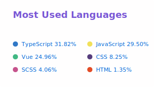

<h1> Hey! Nice to meet you.</h1>

| |  |
| ------------- | ------------- |

I am a front-end developer from China

- 🔭 I’m currently working in BeiJing
- 🌱 I’m currently learning front-end engineering and microfront
- ❤️ I like sleeping 🛌 and watching 📺 
- 💬 if you have some questions ask me [here](https://github.com/n0liu/n0liu/issues).
- 📚 [blogs](https://www.landuoduo.top)

  <strong>languages: </strong>

   <code></code>
  <code></code>
   <code></code>
   <code></code>
   <code></code>
  <code></code>

  <strong>tools: </strong>

  <code></code>
  <code></code>
  <code></code>
  <code></code>
  <code></code>

